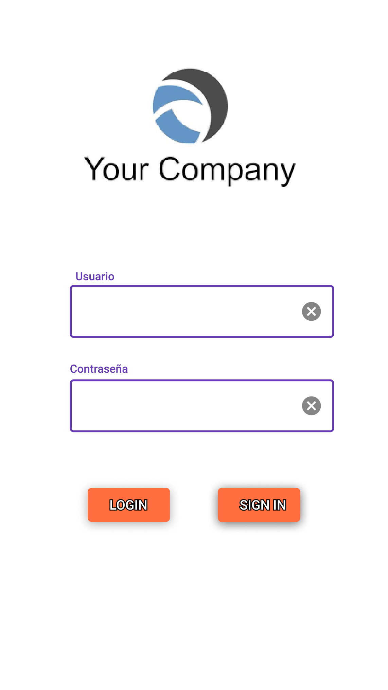

<!--
  FUENTE SINTAXIS BÁSICA MD
  https://www.markdownguide.org/basic-syntax/
-->

# **WEBSITE CREATED WITH HTML, CSS AND JS DINAMICALLY**

## **STARTED**

> Wednesday, April 14th, 2021

## **DELIVERY DATE**

> Thursday, April 15th, 2021

## **SCHOOL SUBJECT FOR WHICH THIS WAS MADE**

> ### Fundamentos de Desarrollo Móvil
>
> - [6SEM - 1 PARTIAL] [2020 - 2021/B]

## **EXPLANATION**

> - This is a project where I had to replicate 2 mobile layouts which were
>   made in Figma by the teacher.
>
> - The 2 screens should be linked for 1 extra point.
>
> - This is made using React Native in JavaScript.

## **LAYOUTS LOCATION**

> ### **FOLDER: final-layouts-objective**
>
> - Google Pixel 2 - 1.pdf
> - Google Pixel 2 - 5.pdf

## **MOBILE LAYOUTS**

<blockquote>
   
  <h3 style="text-align: center;">
    <strong> <em> OBJECTIVE LAYOUT </em> </strong>
  </h3>
   
  

    
    
  

   
  <h3 style="text-align: center;">
    <strong> FINAL RESULT </strong>
  </h3>
   
  

    <!-- 
     -->
  

   
</blockquote>
<!-- >  -->
<!-- >  -->

## **WHAT I USED**
>
> - I used ESLint with Airbnb coding style conventions with some own
>   personalized rules according to what I like. This was not asked by the
>   teacher.
>
> - Expo Developer Tools to see the changes either in web or in the Android
>   device.
>
> ### ***I HAD TO UPGRADE THE EXPO SDK***
>
> I had to upgrade the expo SDK to the latest version following the next
> tutorial in the section ***"Upgrading Your App"***:
>
> ***[Upgrading Expo tutorial](https://blog.expo.io/expo-sdk-35-is-now-available-beee0dfafbf4 "Expo SDK 35 is now available - Upgrading Your App")***
>
> ### **REACT NAVIGATION - NavigationContainer**
>
> I needed to install React Navigation. For that, I followed the tutorials from:
>
> - ***[[Youtube video] React Native Tutorial #19 - React Navigation Setup](https://www.youtube.com/watch?v=OmQCU-3KPms&list=PL4cUxeGkcC9ixPU-QkScoRBVxtPPzVjrQ&index=20&ab_channel=TheNetNinja "[Youtube video] React Native Tutorial #19 - React Navigation Setup")***
> - ***[Getting started with React Navigation 6.x (current)](https://reactnavigation.org/docs/6.x/getting-started "Getting started with React Navigation 6.x (current)")***
> <blockquote>
> 
  <h3><strong><em>HOW TO USE CUSTOM FONTS</em></strong></h3>
  
I had to install <code><strong><em>expo-font</em></strong></code> using the following command:

  <!-- white-space: pre; <- AGREGA ESPACIO ANTES Y DESPUÉS DEL TEXTO. -->
  <blockquote style="white-space: pre-wrap;">
    <code style="color: #1ABC9C;"><strong><em>expo install <code style="color: #F7DC6F;">expo-font</code></em></strong></code>
  </blockquote>
  
  <h3><strong><em>INSTALL AppLoading</em></strong></h3>
  
I had to install <code><strong><em>expo-app-loading</em></strong></code> using the following command:

  <!-- white-space: pre; <- AGREGA ESPACIO ANTES Y DESPUÉS DEL TEXTO. -->
  <blockquote style="white-space: pre-wrap;">
    <code style="color: #1ABC9C;"><strong><em>expo install <code style="color: #F7DC6F;">expo-app-loading</code></em></strong></code>
  </blockquote>

</blockquote>

>
> For this, I followed the tutorial from this video:
>
> ***[[Youtube video] React Native Tutorial #17 - Custom Fonts](https://www.youtube.com/watch?v=IY5OBeL9LNE&list=PL4cUxeGkcC9ixPU-QkScoRBVxtPPzVjrQ&index=18&ab_channel=TheNetNinja "[Youtube video] React Native Tutorial #17 - Custom Fonts")***
>
>> ***The method for getting the fonts must be in the entry file, and the defined***
> ***font styles will be accesible from any file.***
>
> ### TUTORIALS I FOLLOWED
>
> I followed some tutorials in order to my better understanding of some things.
>
> - ***[[35 videos] React Native Tutorial for Beginners [Youtube playlist]](https://www.youtube.com/playlist?list=PL4cUxeGkcC9ixPU-QkScoRBVxtPPzVjrQ "I only watched some videos")***
>

## I FOUND A PROBLEM WITH VERSIONS
>
> I found the next problem:
> Some dependencies are incompatible with the installed expo package version:
>
> - `react-native-screens` - expected version range: `~3.0.0`
> - `actual version installed`: `^3.1.1`
>
> Your project may not work correctly until you install the correct versions of
> the packages.
>
> To install the correct versions of these packages, please run: expo install
> [package-name ...]
>
> ### ***APPARENT SOLUTION***
>
> I found a post where this is pressumably solved:
>
> - [[Stack Overflow]React Native - Dependencies are not compatible with currently expo package version when running npm start](https://stackoverflow.com/questions/61785783/react-native-dependencies-are-not-compatible-with-currently-expo-package-versi "[Stack Overflow]React Native - Dependencies are not compatible with currently expo package version when running npm start")
>
> **QUESTION'S PROBLEM**
>
> `@react-native-community/netinfo` - expected version range: `5.5.1` - actual
> version installed: `^5.8.1`
>
> Answer from (refering to the specific dependency of the question):
> *Khalid Almannai*:
>
>> The fix is to run "expo update" on the project folder.
>>
>> **Update:**
>>
>> You can also use the following:
>>
>> `expo install @react-native-community/netinfo@5.8.1`
>>
>> to fix the problem instead of using the big hammer "expo update" :)
>
> <blockquote>
  <h2 style="color: #0DF1C4; font-weight: 700;"> WORKING SOLUTION </h2>
  

    The following solution worked for me. The warning message stopped showing
    up.
  

  <code style="color: #F1E70D; font-weight: bold; display: flex;">
    expo install 
    <code style="color: #D481F5;">react-native-screens</code>@<code style="color: #F167F1;">3.0.0</code>
    <!--
      Quería mantener el espacio después del expo-install, pero no se podía.
      Encontré en este sitio
      - https://www.computerhope.com/issues/ch001662.htm#:~:text=To%20create%20extra%20spaces%20before,breaking%20space)%20extended%20HTML%20character.
      Que con el tag <pre> se conservan los espacios y eso. Por eso la utilcé,
      aunque se ve muy mal con tantos estilos y eso. Si supiera otra forma de
      hacerlo, lo haría.
    -->
    <!--
    <pre style="color: inherit; font-weight: inherit; font-family: inherit;background-color: transparent; margin: 0; padding: 0;">
    expo install 
    </pre>
    -->
  </code>
  </blockquote>
